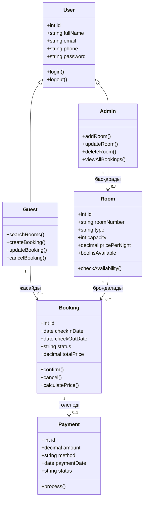

# Class диаграммасы

Hotel Booking System жүйесінің негізгі кластары.

## Кластардың сипаттамасы

| Класс | Міндеті |
|---|---|
| User | Жүйе пайдаланушысының жалпы деректері |
| Guest | Бөлме іздейтін және брондайтын қонақ |
| Admin | Бөлмелер мен брондауларды басқаратын әкімші |
| Room | Қонақүй бөлмесі |
| Booking | Брондау ақпараты (күндер, күйі, құны) |
| Payment | Брондау төлемі |
