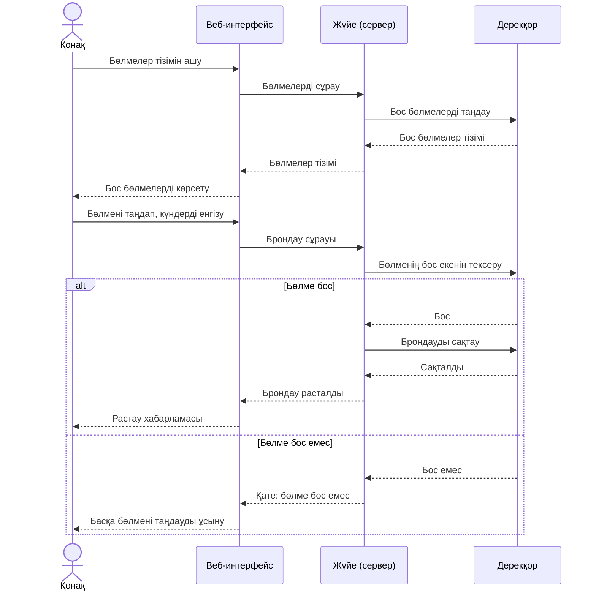

# Sequence диаграммасы

Сценарий: қонақтың бөлмені брондауы.

```mermaid
sequenceDiagram
    actor Guest as Қонақ
    participant UI as Веб-интерфейс
    participant Server as Жүйе (сервер)
    participant DB as Дерекқор

    Guest->>UI: Бөлмелер тізімін ашу
    UI->>Server: Бөлмелерді сұрау
    Server->>DB: Бос бөлмелерді таңдау
    DB-->>Server: Бос бөлмелер тізімі
    Server-->>UI: Бөлмелер тізімі
    UI-->>Guest: Бос бөлмелерді көрсету

    Guest->>UI: Бөлмені таңдап, күндерді енгізу
    UI->>Server: Брондау сұрауы
    Server->>DB: Бөлменің бос екенін тексеру

    alt Бөлме бос
        DB-->>Server: Бос
        Server->>DB: Брондауды сақтау
        DB-->>Server: Сақталды
        Server-->>UI: Брондау расталды
        UI-->>Guest: Растау хабарламасы
    else Бөлме бос емес
        DB-->>Server: Бос емес
        Server-->>UI: Қате: бөлме бос емес
        UI-->>Guest: Басқа бөлмені таңдауды ұсыну
    end
```
