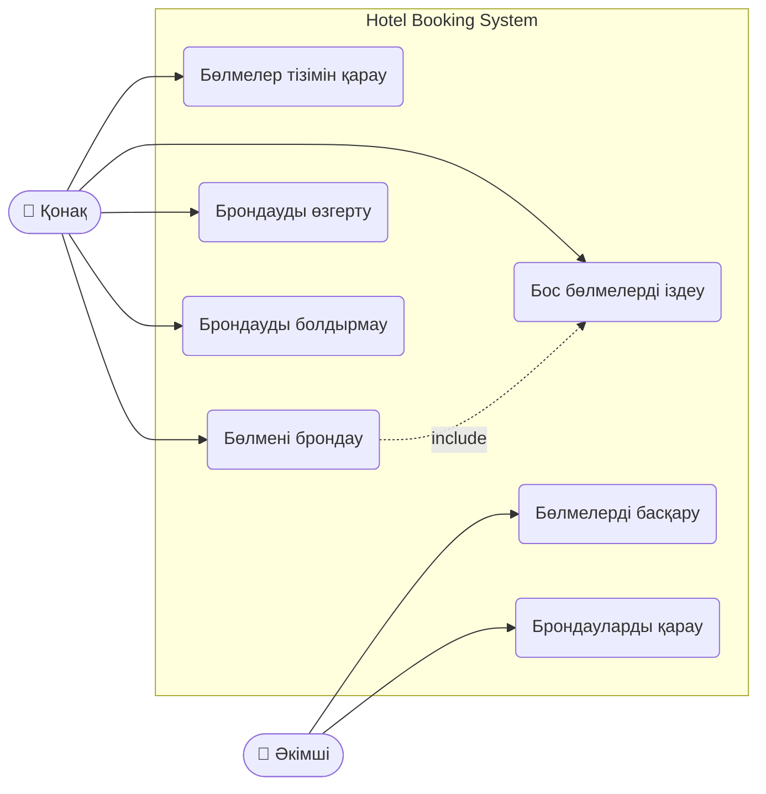

# Use Case диаграммасы

Hotel Booking System жүйесінің қолдану сценарийлері.

## Актор сипаттамасы

| Актор | Рөлі |
|---|---|
| Қонақ | Бөлмелерді қарайды, іздейді, брондайды, брондауды өзгертеді немесе болдырмайды |
| Әкімші | Бөлмелерді қосады, өңдейді, жояды және барлық брондауларды қарайды |
